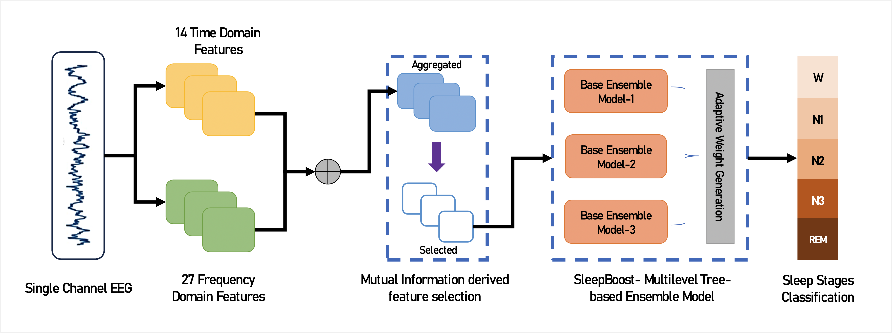
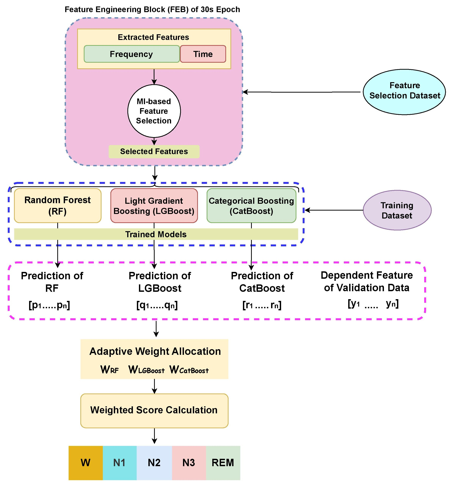

```markdown
# SleepBoost: A Multi-level Tree-based Ensemble Model for Automatic Sleep Stage Classification

<p align="center">
  
</p>

Neurodegenerative diseases often exhibit a strong link with sleep disruption, highlighting the importance of effective sleep stage monitoring. In this light, Automatic Sleep Stage Classification (ASSC) plays a pivotal role, now more streamlined than ever due to the advancements in deep learning (DL). However, the opaque nature of DL models can be a barrier in their clinical adoption, due to trust concerns among medical practitioners. To bridge this gap, we introduce **SleepBoost**, a transparent multi-level tree-based ensemble model specifically designed for ASSC. Our approach includes:

- **Feature Engineering Block (FEB)**  
  Extracts 42 time- and frequency-domain features; selects 17 with mutual information > 0.23.
- **Multi-level Ensemble**  
  Trains Random Forest, LightGBM, and CatBoost as base learners in a tree structure.
- **Adaptive Weight Allocation**  
  Novel reward-based mechanism to combine model outputs.

Tested on the Sleep-EDF-20 dataset, SleepBoost achieves:

- **Accuracy:** 86.3%  
- **F1-score:** 80.9%  
- **Cohen’s κ:** 0.807  

These results outperform leading DL models in ASSC. An ablation study underscores the critical role of our selective feature extraction in enhancing both accuracy and interpretability—essential for clinical use.

---

## 📊 Overview of the Method

<p align="center">
  
</p>

1. **Feature Extraction**  
   Run three base learners (Random Forest, LightGBM, CatBoost) on the same feature set.  
2. **Adaptive Weight Calculation**  
   Compute reward-based weights from base learner predictions.  
3. **Final Prediction**  
   Aggregate weighted scores to assign each 30 s epoch a sleep stage.

---

## 📁 Repository Structure

```

├── data/
│   ├── download\_physionet.sh      # Script to download Sleep-EDF data
│   └── prepare\_physionet.py       # Extract specific EEG channels & labels
├── figures/                       # All paper figures
├── src/
│   ├── FeatureExtraction.py       # Extract time/frequency features
│   ├── FeatureSelection.py        # Rank & select features via MI
│   ├── SleepBoost.py              # Standalone model evaluation
│   └── SleepBoostKFold.py         # 10-fold cross-validation
├── supplementary/                 # Supplementary materials
├── requirements.txt               # Python dependencies
└── README.md                      # This file

````

---

## 🛠️ Preparing the Dataset

We use the [Sleep-EDF-20 dataset](https://www.physionet.org/content/sleep-edfx/1.0.0/).

```bash
cd data
chmod +x download_physionet.sh
./download_physionet.sh
````

Extract the EEG channels “EEG Fpz-Cz” and “EEG Pz-Oz”:

```bash
python prepare_physionet.py \
  --data_dir data \
  --output_dir data/eeg_fpz_cz \
  --select_ch "EEG Fpz-Cz"

python prepare_physionet.py \
  --data_dir data \
  --output_dir data/eeg_pz_oz \
  --select_ch "EEG Pz-Oz"
```

---

## ⚙️ Environment Setup

### Using `venv`

```bash
git clone <repo_url>
cd SleepBoost
python3.11 -m venv sleepboost
source ./sleepboost/bin/activate
pip install -r requirements.txt
```

### Using `conda`

```bash
git clone <repo_url>
cd SleepBoost
conda create -n sleepboost python=3.11
conda activate sleepboost
pip install -r requirements.txt
```

---

## ▶️ Running the Code

1. **Feature Extraction**

   ```bash
   python src/FeatureExtraction.py --input_dir data/eeg_fpz_cz --output_dir features/
   ```

2. **Feature Selection**

   ```bash
   python src/FeatureSelection.py --features_dir features/ --output_file selected_features.csv
   ```

3. **Standalone Test**

   ```bash
   # Edit the datapath on line 44 of src/SleepBoost.py or pass as argument
   python src/SleepBoost.py
   ```

4. **10-Fold Cross-Validation**

   ```bash
   # Edit the datapath on line 46 of src/SleepBoostKFold.py or pass as argument
   python src/SleepBoostKFold.py
   ```

---

## 📖 Citation

If you use our code or methodology, please cite:

```bibtex
@article{sleepboost2023,
  title        = {SleepBoost: A Multi-level Tree-based Ensemble Model for Automatic Sleep Stage Classification},
  author       = {Author 1 and Author 2 and Author 3},
  journal      = {Journal Name},
  volume       = {xx},
  number       = {xx},
  pages        = {xx--xx},
  year         = {2023},
  publisher    = {Publisher}
}
```

```
```
